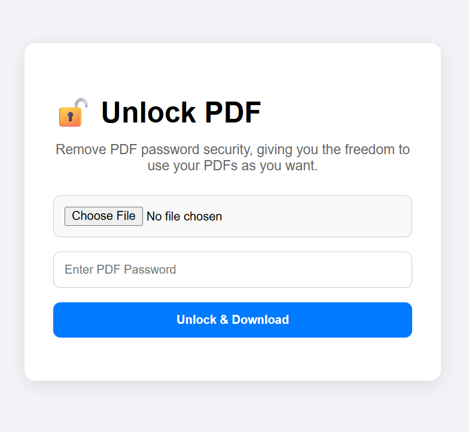

# 🔓 PDF Unlocker – Remove Password from Secured PDFs

A simple, self-hosted web app to upload password-protected PDF files, unlock them using the provided password, and download the unprotected version. Built with Node.js and `qpdf`, packaged in Docker for easy deployment.

---

## ✨ Features

- 🔐 Remove passwords from secured PDF files
- 📄 Keeps original filename (adds `_Unlocked`)
- 📱 Clean, mobile-responsive web UI
- 🚀 Dockerized for one-command deployment
- 🧩 Easy to run on any Docker host

---

## 📸 Demo



---

## 📂 Folder Structure

```bash
unlock-pdf/
├── server.js
├── Dockerfile
├── docker-compose.yml
├── package.json
├── public/
│   └── index.html
├── uploads/
└── README.md
```

---

## 🐳 Run with Docker

Run directly:

```bash
docker run -p 3000:3000 jituboss/pdf-unlock
```

To stop the container, press `Ctrl+C` or run:

```bash
docker stop $(docker ps -q --filter ancestor=jituboss/pdf-unlock)
```

---

## ⚙️ Docker Compose Example

```yaml
version: '3.8'
services:
  pdf-unlock:
    image: jituboss/pdf-unlock:latest
    container_name: pdf-unlock
    ports:
      - "3000:3000"
    volumes:
      - ./uploads:/app/uploads
    restart: unless-stopped
```

Deploy with:

```bash
docker-compose up -d
```

---

## 🔐 Requirements

- A PDF file with password protection
- The correct password
- Docker system to run the container

---

## 📝 License

MIT © [jituboss](https://github.com/jituboss)

---

## 🌐 Credits

PDF unlocking powered by [qpdf](https://github.com/qpdf/qpdf)